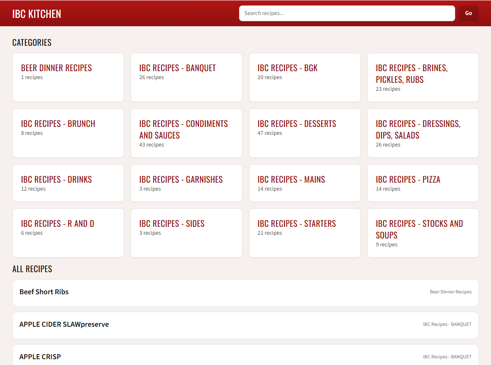
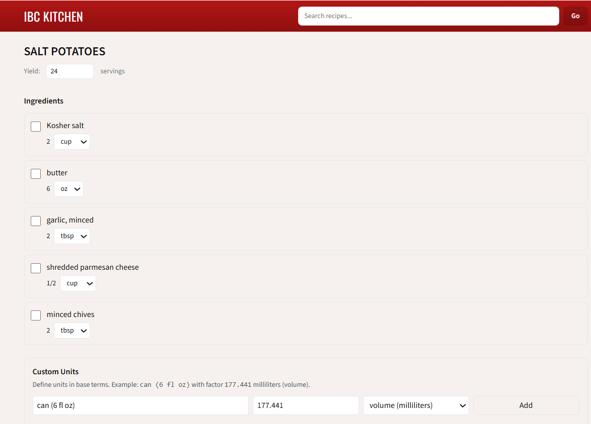

# IBC Kitchen Recipes

A Next.js (App Router) + TypeScript web app for browsing and executing professional kitchen recipes — with **unit conversion**, **yield scaling**, and a **DOCX → typed JSON** import pipeline.

## Demo
- Screenshots:

  <p align="center">
    
    
  </p>

- Live link: [ibc-kitchen.vercel.app](ibc-kitchen.vercel.app)

---

## Features
- **Recipe browsing**
  - Category index + category detail pages
  - Individual recipe pages via stable URL slugs
- **Cook-mode utilities**
  - Ingredient checklist persisted via local storage
  - Built-in **timer** component for prep/line workflows
- **Unit conversion + formatting**
  - Mass ↔ mass and volume ↔ volume conversions
  - **Mass ↔ volume conversions with density** (e.g., oil grams → mL)
  - Friendly fraction display (e.g., `1.5 → 1 1/2`)
- **Import pipeline: DOCX → typed data**
  - Reads a ZIP of `.docx` files and extracts lines from `word/document.xml`
  - Uses heuristics to detect **ingredients vs steps**
  - Normalizes/aliases common kitchen units (tsp/tbsp/cup/oz/lb/g/kg/ml/qt/gal, etc.)
  - Emits a TypeScript module (`data/recipes/imported.ts`) for fast, static site rendering

---

## Tech Stack
- **Frontend:** Next.js (App Router), React, TypeScript, Tailwind CSS
- **Testing:** Vitest (smoke tests) + node `assert` for script-level checks
- **Data pipeline:** Node.js scripts (`tsx`), JSZip, fast-xml-parser, minimist, slugify

---

## Architecture
- `app/`
  - `page.tsx` — landing page
  - `categories/page.tsx` — category listing
  - `c/[slug]/page.tsx` — category detail (recipes by category)
  - `recipes/[slug]/page.tsx` — recipe detail page
  - `layout.tsx`, `globals.css` — app shell/styles
- `components/`
  - `Hero.tsx` — landing/marketing header
  - `SiteHeader.tsx` / `SiteFooter.tsx` — shared navigation + footer
  - `Timer.tsx` — cook-mode timer widget
- `data/recipes/`
  - `index.ts` — recipe exports/aggregation
  - `imported.ts` — **auto-generated** recipes from the import pipeline
- `lib/`
  - `conversions.ts` — unit conversions, density-aware conversions, fraction formatting
  - `slug.ts` — slug utilities (routing)
  - `useLocalStorage.ts` — persistent checklist state
- `scripts/`
  - `import-docx-zip.ts` — ZIP(DOCX) → `imported.ts`
  - `test-conversions.ts` — quick assertions for conversion correctness
- `tests/`
  - `smoke.test.ts` — basic app sanity checks
- `types/recipe.ts` — `Recipe` / `Ingredient` types (supports optional `density_g_per_ml` and `prepNote`)

---

## Getting Started

### Prerequisites
- Node.js 18+ recommended

### Install & run
```bash
npm install
npm run dev
# open http://localhost:3000
```

---

## Importing Recipes from DOCX
This project includes a script that converts a ZIP of Word documents into typed recipe data.

### Input format

- A ZIP containing .docx files (nested folders are ok)
- Each .docx should include:
  - a title (often first line)
  - ingredient lines (bullets or quantity/unit patterns)
  - step lines (non-ingredient text)

### Run importer
```bash
# Example (Windows PowerShell)
npx tsx scripts\import-docx-zip.ts --zip .\recipes.zip --out .\data\recipes\imported.ts --debug --peek 3
```

#### Output
- Generates: `data/recipes/imported.ts`
- Each recipe includes:
  - `slug`, `title`, `category`
  - `yieldCount`, `yieldUnit`
  - `ingredients[]` with `{ orderIndex, name, quantity, unit }`
  - `steps[]`

> Notes:
>  - **"The importer skips docs if it can’t confidently extract both ingredients and steps."**
>  - **"Unit normalization maps common variants (e.g., `tablespoons → tbsp`, `c. → cup`, `# → lb`)."**
>  - **"Yield-like lines (`Yield:`, `Serves`, `Makes`) are treated as metadata, not ingredients."**

---

## Conversion Sanity Checks

You can run a quick conversion test script to validate core conversion behavior:

```bash
npx tsx scripts/test-conversions.ts
```
This checks:
- mass → mass (e.g., `1000 g → 1 kg`)
- volume → volume (e.g., `2 cup → 473.176 ml`)
- mass ↔ volume throws without density
- mass ↔ volume succeeds with density (`density_g_per_ml`)
- fraction formatting (`1.5 → 1 1/2`)

---

## Data & Privacy
This repo is designed to work with internal/proprietary recipe docs.
If you’re publishing publicly, consider:
- excluding the raw `recipes.zip` / source documents
- committing only the generated `imported.ts` (or redacted sample recipes)

---
